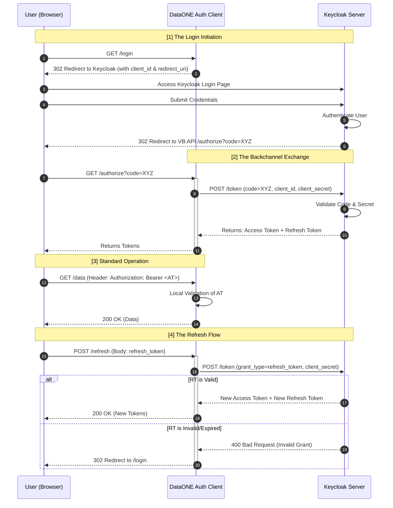

### DataONE Auth

```mermaid
sequenceDiagram
    autonumber
    participant User as User (Browser)
    participant API as DataONE Auth Client
    participant KC as Keycloak Server

    Note over User, KC: [1] The Login Initiation
    User->>API: GET /login
    API-->>User: 302 Redirect to Keycloak (with client_id & redirect_uri)
    
    User->>KC: Access Keycloak Login Page
    User->>KC: Submit Credentials
    KC->>KC: Authenticate User
    KC-->>User: 302 Redirect to VB API /authorize?code=XYZ

    Note over API, KC: [2] The Backchannel Exchange
    User->>API: GET /authorize?code=XYZ
    activate API
    API->>KC: POST /token (code=XYZ, client_id, client_secret)
    KC->>KC: Validate Code & Secret
    KC-->>API: Returns: Access Token + Refresh Token
    API-->>User: Returns Tokens
    deactivate API

    Note over User, API: [3] Standard Operation
    User->>API: GET /data (Header: Authorization: Bearer <AT>)
    API->>API: Local Validation of AT
    API-->>User: 200 OK (Data)

    Note over User, KC: [4] The Refresh Flow
    User->>API: POST /refresh (Body: refresh_token)
    activate API
    API->>KC: POST /token (grant_type=refresh_token, client_secret)
    alt RT is Valid
        KC-->>API: New Access Token + New Refresh Token
        API-->>User: 200 OK (New Tokens)
    else RT is Invalid/Expired
        KC-->>API: 400 Bad Request (Invalid Grant)
        API-->>User: 302 Redirect to /login
    end
    deactivate API
```
